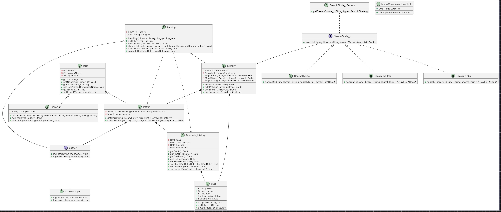

Here’s a design documentation template for your library management system that you can include in your `README.md`. It provides an overview of the system architecture, class descriptions, and relationships, which will help readers understand the project's structure and functionality.

---

# Library Management System Design Documentation

## Overview
The Library Management System is designed to manage library operations including book lending, returning, and user management. The system supports two types of users: Librarians and Patrons. It facilitates efficient tracking of borrowing history, book availability, and searching for books.

## Class Diagram
The system architecture is represented in the following UML class diagram: (LibraryManagement.jpg)

## Class Descriptions

### User
The base class representing a user in the system. It contains basic user attributes and methods for user management.
- **Attributes**:
  - `userId`: Unique identifier for the user.
  - `userName`: Name of the user.
  - `email`: Email address of the user.
  
- **Methods**:
  - Getters and setters for user attributes.

### Librarian (Inherits from User)
Represents a librarian in the library system.
- **Attributes**:
  - `employeeCode`: Unique employee identifier for the librarian.
  
- **Methods**:
  - Constructor to initialize user details and employee code.

### Patron (Inherits from User)
Represents a library patron (member).
- **Attributes**:
  - `borrowingHistoryList`: List of borrowing history records.
  - `logger`: Logger instance for logging messages.
  
- **Methods**:
  - Methods to manage borrowing history.

### Logger (Interface)
Defines logging functionality for the system.
- **Methods**:
  - `logInfo(String message)`: Logs informational messages.
  - `logError(String message)`: Logs error messages.

### ConsoleLogger (Implements Logger)
Implements the logging functionality to log messages to the console.

### Book
Represents a book in the library system.
- **Attributes**:
  - `title`: Title of the book.
  - `author`: Author of the book.
  - `isbn`: ISBN number of the book.
  - `isAvailable`: Availability status of the book.
  - `status`: Current status of the book (e.g., available, checked out).

### Library
Manages a collection of books and patrons.
- **Attributes**:
  - `books`: List of books in the library.
  - `patrons`: List of patrons registered in the library.
  
- **Methods**:
  - Methods to add books and patrons, and retrieve lists.

### BorrowingHistory
Tracks the borrowing details of a book.
- **Attributes**:
  - `book`: The book being borrowed.
  - `checkOutDate`: The date the book was checked out.
  - `dueDate`: The date the book is due for return.
  - `returnDate`: The date the book was returned.
  
- **Methods**:
  - Getters and setters for the attributes.

### Lending
Handles the operations of checking out and returning books.
- **Attributes**:
  - `library`: Reference to the library instance.
  - `logger`: Logger instance for logging messages.
  
- **Methods**:
  - Methods to check out and return books, and compute due dates.

### SearchStrategy (Interface)
Defines the strategy for searching books in the library.
- **Methods**:
  - `search(Library library, String searchTerm)`: Abstract method for searching.

### SearchByTitle, SearchByAuthor, SearchByIsbn (Implement SearchStrategy)
Implementations of the search strategy for searching books by title, author, and ISBN.

### SearchStrategyFactory
Factory class for creating search strategies based on type.

### LibraryManagementConstants
Holds constant values used across the application.
- **Attributes**:
  - `DUE_TIME_DAYS`: Number of days until a book is due.

## Relationships
- **Inheritance**:
  - `User` is the base class for `Librarian` and `Patron`.
  
- **Associations**:
  - `Library` contains multiple `Book` and `Patron` instances.
  - `Patron` has a list of `BorrowingHistory`.
  - `BorrowingHistory` is associated with a `Book`.
  - `Lending` class interacts with `Library`, `Logger`, `Patron`, and `BorrowingHistory`.
  
- **Composition**:
  - `Lending` is composed of `Library` and `Logger`.

## Usage
To use the Library Management System, follow these steps:
1. Initialize the `Library` and `Logger`.
2. Add `Book` and `Patron` instances to the library.
3. Use the `Lending` class to manage book checkouts and returns.
4. Utilize the search functionality through the `SearchStrategyFactory`.

## Conclusion
This design provides a robust foundation for managing library operations efficiently. It allows easy extension and maintenance as the system grows.

---
